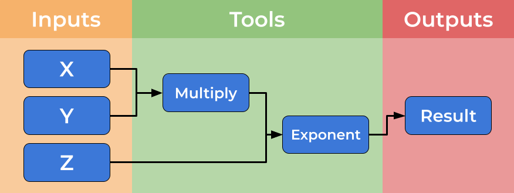
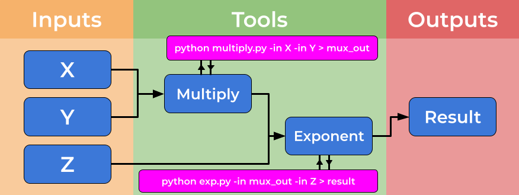

:::::::::::::::::::::::::::::::::::::: questions

- What are computational workflows, and why are they useful?
- What is Common Workflow Language?
- How are CWL workflows written?
- How do CWL workflows compare to shell workflows?
- What are the advantages of using CWL workflows?

::::::::::::::::::::::::::::::::::::::::::::::::

::::::::::::::::::::::::::::::::::::: objectives

- Understand why you might use CWL instead of a shell script
- Recognise the advantages of using a computational workflow

::::::::::::::::::::::::::::::::::::::::::::::::

## Computational Workflows

A computational workflow is a formalised chain of software tools, which explicitly
defines how data is input, how it flows between tools and how it is output. 
Computational workflows are widely used for data analysis and enable rapid innovation 
and decision making.

The most important benefit of computational workflows is that they require a user
to write down, fully formalise and automate their dataflow and process. While this
can be a challenge, it allows greater repeatability, shareability and robustness 
to be achieved.

Below is an image showing a graphical representation of a dummy workflow. You can
see inputs being made on the left, data flowing and being processed by tools and 
passed to the output.

{alt='dummy workflow image'}

While you can imagine creating shell scripts (Bash or Make) to meet this need, 
using a formal workflow language (such as CWL) brings several further benefits 
such as introducing abstraction and improved scalability and portability. We will
discuss some of these benefits here.

Computational workflows explicitly create a divide between a user’s dataflow and
the computational details which underpin the chain of tools, placing these elements
in separate files. The dataflow is described by the **workflow**, where tools are
described at a high level. The tools implementation is specified by 
**tool descriptors** where the full complexity of a tools usage is handled. The 
image below shows how tool descriptors underpin workflow steps and hide complexity.

{alt='Dummy workflow tool descriptor'}

This abstraction allows the use of heterogeneous tools, potentially shared by third
parties, and allows workflow users to connect and utilise a wide range of tools and 
techniques without the need for significant computational experience. An example 
of the strength of this approach is the ability for workflows to use (e.g. Docker) 
containers "under the hood" without the user needing to install, download or learn any further technologies.

By adapting tool descriptors to multiple platforms, this abstraction allows the 
same workflow to be used on different platforms, transparently to the workflow user. 
This means users can move between local development and cloud and HPC solutions seamlessly.

## Computational Workflow Managers

Computational workflow managers further extend this abstraction, providing high 
level tools for managing data and tools, aiming to help users to design and run 
computational workflows more easily. A computational workflow engine provides an 
interface for launching workflows, specifying and handling inputs and collecting 
and exporting outputs, they can also help users by storing completed steps of 
workflows, allowing workflows to be resumed part way, or rerun with minimal changes.

Further, computational workflow managers aid users with the automation, monitoring 
and provenance tracking of the dataflow. They may also help users to produce and 
understand reports and outputs from their workflow.

:::::::::::::::::::::::::: callout

### Workflows and Provenance

Another advantage of workflows is that by producing computational workflows in a 
standard format, and publishing them (alongside any data) with open access, allow 
dataflows to be shared in a more FAIR (Findable, Accessible, Interoperable, and 
Reusable) manner.

::::::::::::::::::::::::::

## Why a standard for workflows is needed?

The rise in popularity of workflows has been matched by a rise in the 
number of disparate workflow managers that are available, each with their own 
syntax or methods for describing the tools and workflows, reducing portability 
and interoperability of these workflows. The Common Workflow Language (CWL) 
standard has been developed to address these problems, and to serve the general 
computational workflow needs described above.

## Benefits of Computational Workflows

In summary, computational workflows bring many benefits and an ideal computation 
workflow adopts and provides the properties below:

**Handy Properties of Computational Workflows**[^2]

| 	                                                            | 	                                         |                                                                                                                                                                                                                    |
|--------------------------------------------------------------|-------------------------------------------|--------------------------------------------------------------------------------------------------------------------------------------------------------------------------------------------------------------------|
| {alt='props compute 01 png'} 	 | **Composition & Abstraction** 	           | Using the best code written by 3rd parties Handle heterogeneity Shield Complexity & incompatibility Shareable reusable, re-mixable methods 	                                                              |
| {alt='props compute 02 png'} 	 | **Sharing & Adaptability**    	           | Shared method, publishable know-how BYOD / parameters Different implementations Changes in execution infrastructure                        	                                                              |
| {alt='props compute 03 png'} 	 | **Automation**                	           | Repetitive reproducible pipelines Simulation sweeps Manage data and control flow Optimised monitoring & recovery Automated deployment   	                                                              |
| {alt='props compute 04 png'} 	 | **Reporting & Accreditation** 	           | Provenance logging & data lineage Auto-documentation Result comparison                                                                        	                                                              |
| {alt='props compute 05 png'} 	 | **Scalability & Infrastructure Access** 	 | Accessing infrastructures, datasets and tools   Optimised computation and data handling   Parallelisation   Secure sensitive data access & management   Interoperating datasets & permission handling	 |
| {alt='props compute 06 png'}   | **Portability**                           | Dependency handling   Containerisation & packaging   Moving between on premise & cloud                                                                                                                       |

## Common Workflow Language

CWL is a free and open standard for describing command-line tool based workflows[^3].

These standards provide a common, but reduced, set of abstractions that are both used in
practice and implemented in many popular workflow managers.
The CWL language is declarative, enabling computational workflows to be constructed from
diverse software tools, executing each through their command-line interface.

:::::::::::::::::::: callout

### Shell scripts reduce portability
Previously researchers might write shell scripts to link together these command-line tools.
Although these scripts might provide a direct means of accessing the tools, writing and
maintaining them requires specific knowledge of the system that they will be used on.
Shell scripts are not easily portable, and so researchers can easily end up spending more
time maintaining the scripts than carrying out their research.
The aim of CWL is to reduce that barrier of usage of these tools to researchers.

::::::::::::::::::::

CWL workflows are written in a subset of [YAML](https://www.commonwl.org/user_guide/yaml/), with a syntax that does not restrict the
amount of detail provided for a tool or workflow.
The execution model is explicit, all required elements of a tool's runtime environment
must be specified by the CWL tool-description author.
On top of these basic requirements they can also add hints or requirements to the
tool-description, helping to guide users (and workflow engines) on what resources are
needed for a tool.

:::::::::::::::::::: callout

### Containerisation

The CWL standards explicitly support the use of software container technologies, such as [docker][docker] helping
ensure that the execution of tools is reproducible.

::::::::::::::::::::

Data locations are explicitly defined, and working directories kept separate for each tool invocation.
These standards ensure the portability of tools and workflows, allowing the same workflows
to be run on your local machine, or in a HPC or cloud environment, with minimal changes required.

## RNA sequencing example

In this tutorial a bio-informatics RNA-sequencing analysis is used as an example. However,
there is no specific knowledge needed for this tutorial.
RNA-sequencing is a technique which examines the quantity and sequences of
[RNA](https://en.wikipedia.org/wiki/RNA) in a sample using next-generation sequencing.
The RNA reads are analyzed to measure the relative numbers of different RNA molecules in
the sample. This analysis is differential gene expression.

The process looks like this:

{alt='RNASeq Workflow graph' style='height: "400px"'}

During this tutorial, only the middle analytical steps will be performed. The adapter trimming is skipped.
These steps will be done:  
- Quality control (FASTQC)
- Alignment (mapping)
- Counting reads associated with genes

The different tools necessary for this analysis are already available. In this tutorial a
workflow will be set up to connect these tools and generate the desired output files.

::::::::::::::::::::::::::::::::::::: keypoints

- CWL is a standard for describing workflows based on command-line tools
- CWL workflows are written in a subset of YAML
- A CWL workflow is more portable than a shell script
- CWL supports software containers, supporting reproducibility on different machines

::::::::::::::::::::::::::::::::::::::::::::::::

## References

[^1]: M. R. Gryk and B. Ludäscher (2017): Workflows and Provenance: Toward Information Science Solutions for the Natural Sciences. Library Trends. [https://doi.org/10.1353/lib.2017.0018](https://doi.org/10.1353/lib.2017.0018)
[^2]: C. Goble (2021): FAIR Computational Workflows. JOBIM Proceedings. [https://www.slideshare.net/carolegoble/fair-computational-workflows-249721518](https://www.slideshare.net/carolegoble/fair-computational-workflows-249721518)
[^3]: M. Wilkinson, M. Dumontier, I. Aalbersberg, et al. (2016): The FAIR Guiding Principles for scientific data management and stewardship. Scientific Data. [https://doi.org/10.1038/sdata.2016.18](https://doi.org/10.1038/sdata.2016.18)
[^4]: M. R. Crusoe, S. Abeln, A. Iosup, P. Amstutz, J. Chilton, N. Tijanić, H. Ménager, S. Soiland-Reyes, B. Gavrilović, C. Goble, The CWL Community (2021): Methods Included: Standardizing Computational Reuse and Portability with the Common Workflow Language. Communication of the ACM. [https://doi.org/10.1145/3486897](https://doi.org/10.1145/3486897)

[docker]: https://www.docker.com/
